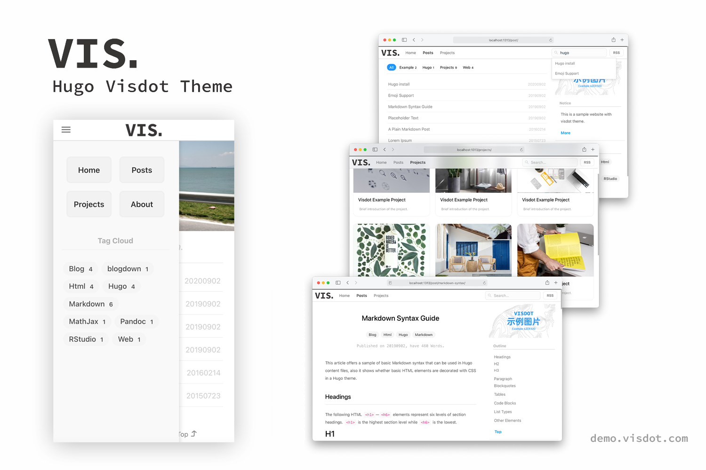

# Hugo Visdot Theme

> A modern minimalist style [Hugo](https://gohugo.io) theme

[](https://gohugo.io)
[](LICENSE)

[English](README.md) | [中文](README_CN.md)

## Demo

[Live Demo](http://demo.visdot.com)



## Features

- White minimalist style
- Top loading progress bar based on pace.js
- In-site search based on fuse.js
- Project showcase page
- Native support for category and tagging system
- Support for mobile device access

## Installation

```sh
git clone https://github.com/leejiawang/hugo-themes-visdot.git themes/vd
```
Download theme files, then copy the config.yaml in the exampleSite to the root of your Hugo site.

