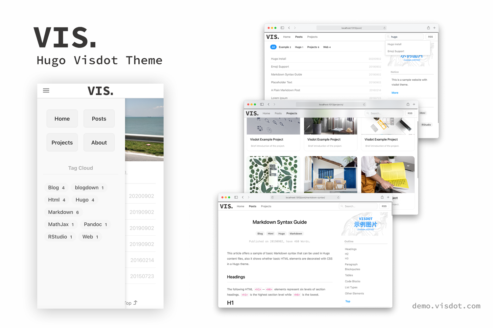

# Hugo Visdot Theme

> 一款现代简约风格的 [Hugo](https://gohugo.io) 主题。 

[](https://gohugo.io)
[](LICENSE)

[English](README.md) | [中文](README_CN.md)

## 预览

[Demo](http://demo.visdot.com)



## 特性

- 白色简约风格
- 基于 pace.js 的顶部加载进度条
- 基于 fuse.js 的站内搜索
- 项目展示页面
- 支持原生的分类和标签系统
- 支持移动设备访问

## 安装

```sh
git clone https://github.com/leejiawang/hugo-themes-visdot.git themes/vd
```
下载主题文件，将根目录中 `config.yaml` 中的主题项内容修改为 `vd`。

> 新用户推荐直接将 `exampleSite` 内的文件复制到站点根目录。 
